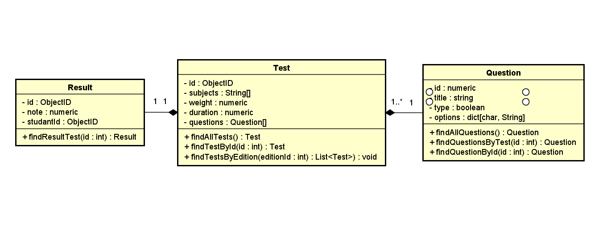

### 46504-04 - Construção de Software - Turma 127 - 2021/1 - Prof. Eduardo Henrique P de Arruda

Alunos: José Goulart, Guilherme Carvalho, Matheus Tosin, Matheus Ferreira

### Class Diagram

  

### Swagger

Documentação disponível no [SwaggerHub](https://app.swaggerhub.com/apis/matheus.tosin/cds/1.0.0)

